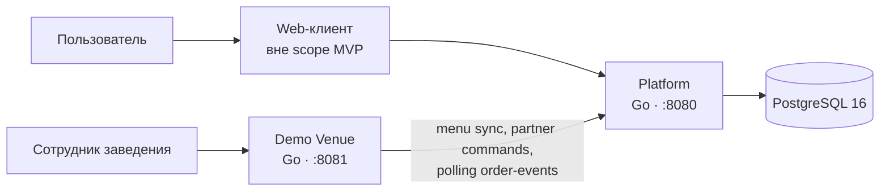
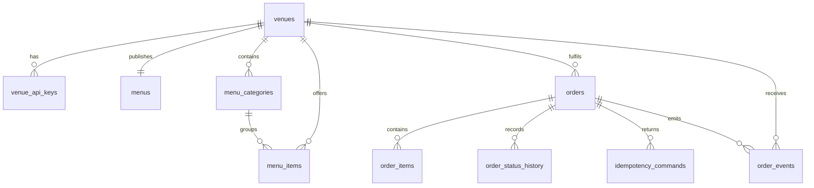

# MealRoute

Пет-проект backend-платформы доставки еды на Go.
Репозиторий содержит два независимых Go-сервиса: основную платформу
`MealRoute` и пример заведения. Они запускаются вместе с PostgreSQL через
Docker Compose.

## Что реализовано

- Клиентский API: каталог заведений, меню, создание заказа, просмотр и отмена.
- Partner API: синхронизация меню, подтверждение/отклонение заказа, смена
  статуса и polling журнала заказов.
- Отдельный сервис demo-заведения со своим API и локальной read-моделью.
- Последовательные PostgreSQL-миграции с начальными данными demo-заведения.
- Идемпотентные команды по `Idempotency-Key`.
- Доставка изменений заведению через `order-events` с семантикой
  *at-least-once*, неблокирующей retry-очередью и защитой от устаревших снимков.
- Атомарная относительно menu sync финальная проверка версии при создании заказа.
- OpenAPI request validation и единый JSON `ProblemDetails` для ошибок роутинга,
  параметров, заголовков и тела запроса.
- OpenAPI-контракты и сгенерированный Go transport для обоих сервисов.
- CJM пользователя и заведения в PlantUML.
- `golangci-lint` v2 и GitHub Actions CI для lint, unit, HTTP, PostgreSQL и
  Compose-интеграционных тестов.

## Быстрый запуск

Требования: Docker Desktop с Docker Compose v2.

Runtime-конфигурация не зашита в Go, миграции или Compose. Перед первым запуском
создайте локальный `.env` из безопасного шаблона и при необходимости замените
локальные credentials:

```bash
cp .env.example .env
docker compose up --build
```

PowerShell: `Copy-Item .env.example .env`.

После старта доступны:

| Сервис | Адрес | Назначение |
| --- | --- | --- |
| Platform | `http://localhost:8080` | API платформы |
| Demo Venue | `http://localhost:8081` | API отдельного заведения |
| PostgreSQL | `localhost:5432` | Хранилище platform |

Проверка готовности:

```bash
curl http://localhost:8080/healthz
curl http://localhost:8081/v1/health
```

Имена базы и пользователя, пароль, API-ключ, адреса, порты, интервалы polling и
HTTP-таймауты берутся из `.env`. Файл `.env` исключён из Git и Docker build
context; `.env.example` содержит только безопасные значения для локального
запуска. Миграция применяется PostgreSQL при первом создании volume. Чтобы
полностью пересоздать начальные данные, остановите окружение и удалите volume
(команда необратимо удалит локальную БД):

```bash
docker compose down -v
docker compose up --build
```

`POSTGRES_PASSWORD` применяется образом PostgreSQL только при создании нового
volume. Его изменение в `.env` не ротирует пароль уже существующей роли; для
локальной среды пересоздайте volume командой выше, а в постоянной среде меняйте
роль отдельной управляемой миграцией.

## Сценарий заказа

1. Web-клиент получает каталог и меню через `/api/v1/venues`.
2. Пользователь создаёт заказ в `/api/v1/orders`, передавая `X-User-Id` и
   `Idempotency-Key`. Platform проверяет версию меню, доступность блюд и статус
   заведения, затем под транзакционной блокировкой повторно сверяет версию меню
   и создаёт заказ в `pending_confirmation`.
3. Venue с интервалом `VENUE_SYNC_INTERVAL` читает `/partner/v1/order-events`.
   Неуспешное
   событие попадает в retry-очередь, не блокируя следующие; устаревшие снимки
   игнорируются. Новый заказ сохраняется как `pending_confirmation`, после чего
   оператор явно принимает или отклоняет его через API venue. Venue создаёт
   собственный стабильный `venueOrderId`, отличный от `platformOrderId`, и
   хранит явное соответствие между ними.
4. После явного принятия пользователь видит `accepted` и может отменить заказ,
   пока кухня не начала
   готовить.
5. Platform добавляет `cancelled` в журнал; venue получает событие и прекращает
   обработку локального заказа.

Пользовательские и операционные пути подробно описаны в
[CJM пользователя](docs/cjm/customer-order.puml) и
[CJM заведения](docs/cjm/venue-order.puml).

## API и контракты

| Контракт | Граница |
| --- | --- |
| [openapi.yaml](openapi.yaml) | Platform: клиентский `/api/v1/*` и закрытый partner `/partner/v1/*` API |
| [venue-openapi.yaml](venue-openapi.yaml) | Собственный API отдельного demo-заведения `/v1/*` |
| [контрактные решения](docs/contract-decisions.md) | Владение данными, статусы, идемпотентность и доставка событий |

Transport-код не редактируется вручную. Его можно пересобрать из контрактов:

```bash
cd services/platform && go generate ./...
cd ../venue && go generate ./...
```

## Архитектура

Слои обоих сервисов направлены внутрь:

```text
OpenAPI transport → HTTP handler → application service → domain/port → adapter
```

- `services/platform` — источник истины для заказа, публичного меню и истории
  статусов. Использует PostgreSQL через адаптер `repository/postgres`.
- `services/venue` — отдельный пример интеграции заведения. Его worker отправляет
  снимок меню в platform, читает события polling’ом и вызывает partner-команды.
- `internal/httpapi` отвечает только за HTTP; `internal/service` — за use cases;
  `internal/domain` — за правила переходов; `internal/repository` — за порт
  хранения и его адаптеры.

### C4 Level 2

Исходник диаграммы: [c4-container.puml](docs/architecture/c4-container.puml).



`platform` и `venue` — разные контейнеры в одном Compose-окружении. Внешний
вызов venue направлен только к Partner API platform; platform не зависит от
локального API заведения.

## Модель данных

Исходник ER-диаграммы: [database-er.puml](docs/architecture/database-er.puml).
SQL-миграции находятся в каталоге [services/platform/migrations](services/platform/migrations):
[001_initial_schema.sql](services/platform/migrations/001_initial_schema.sql)
создаёт исходную схему, а
[002_idempotency_response_payload.sql](services/platform/migrations/002_idempotency_response_payload.sql)
последовательно добавляет сохраняемый снимок idempotency-ответа.



Ключевые инварианты:

- `orders` хранит снимок состава, цен и адреса на момент заказа — изменения
  меню не переписывают историю.
- `order_status_history` хранит полный порядок переходов, а `orders.status` —
  текущий статус для фильтрации.
- `idempotency_commands` ограничивает ключ комбинацией `subject + operation +
  idempotency_key` и хранит хэш тела запроса.
- `order_events.sequence_no` даёт упорядоченный cursor для polling, а `id` —
  стабильный `eventId` для дедупликации на стороне venue.
- Строка `venues` синхронизирует menu sync с финальной проверкой `menuVersion`
  при создании заказа, исключая заказ из конкурентно устаревшего снимка.
- JSONB-снимки в `menus.payload`, `orders.payload` и `order_events.order_snapshot`
  позволяют отдавать API-модель без потери исторических данных; нормализованные
  таблицы дают связи, ограничения и поиск.

## Проверка

Конфигурация статического анализа находится в [.golangci.yml](.golangci.yml).
Она включает стандартный набор `golangci-lint`, а также `bodyclose`,
`errorlint`, `misspell`, `nilerr`, `nolintlint`, `gofmt` и `goimports`.
Локальный запуск установленного `golangci-lint`:

```bash
cd services/platform && golangci-lint run --config=../../.golangci.yml ./...
cd ../venue && golangci-lint run --config=../../.golangci.yml ./...
```

Unit- и HTTP-тесты, стандартный анализ:

```bash
cd services/platform && go test -count=1 ./... && go vet ./...
cd ../venue && go test -count=1 ./... && go vet ./...
```

Интеграционные тесты запускаются против поднятого Compose-окружения. Для
PowerShell:

```powershell
docker compose up -d --build --wait
./scripts/test-integration.ps1
```

PostgreSQL-тесты фиксируют конкурентные отмену и начало приготовления, а также
гонку menu sync с созданием заказа. HTTP-тесты проверяют OpenAPI validation и
JSON `ProblemDetails`. Compose-тесты автоматически проверяют принятие, отмену
и отклонение заказа:

```text
GET menu
POST order (Idempotency-Key) → pending_confirmation
operator POST venue status=accepted → platform accepted
POST cancel → cancelled
partner journal содержит created, accepted и cancelled
локальная read-модель demo venue получает cancelled

POST order → pending_confirmation
operator POST venue status=rejected → /partner/v1/orders/{orderId}/reject
platform и локальная read-модель получают rejected
```

Workflow [.github/workflows/ci.yml](.github/workflows/ci.yml) выполняет lint
для обоих модулей, unit-тесты с race detector, `go vet`, затем поднимает чистый
Compose и запускает PostgreSQL- и cross-service-тесты. При ошибке сохраняются
логи контейнеров.

## Граница эксплуатационной готовности

Текущая сборка готова для воспроизводимого MVP-запуска, разработки и
end-to-end проверки: конфигурация валидируется при старте, сервисы завершаются
graceful shutdown, контейнеры работают не от root, секреты не попадают в образы
и репозиторий, а ошибки HTTP имеют единый контракт. Это намеренно не заявляется
как production-ready контур.

Перед эксплуатацией с реальными пользователями потребуются внешний secret
manager, TLS на ingress и между доверительными зонами, пользовательская
аутентификация, rate limiting, метрики/трейсинг, управляемый migration runner и
персистентное хранилище состояния venue worker. Эти возможности пока не
реализованы и относятся к дальнейшему развитию проекта.

Ограничения MVP:

- Web-клиент, аутентификация и авторизация пользователей пока отсутствуют;
  `X-User-Id` — демонстрационный заголовок, который нельзя считать защитой доступа.
- В Compose подключено одно примерное заведение и его локальный API-ключ из
  `.env`. В PostgreSQL сохраняется только SHA-256 fingerprint ключа. Platform
  поддерживает несколько заведений: активный ключ из `venue_api_keys`
  аутентифицирует конкретное venue и изолирует его меню, заказы и события.
  Ротация и выпуск ключей через back-office API остаются вне MVP.
- Venue использует polling с настраиваемым `VENUE_SYNC_INTERVAL` вместо
  callbacks или очереди.
  Повторная доставка штатна и компенсируется `eventId`, idempotency key и cursor.
- Локальная read-модель примерного заведения хранится в памяти и сбрасывается при
  перезапуске контейнера; вместе с ней сбрасываются cursor и retry-очередь, после
  чего venue безопасно воспроизводит журнал с начала. Platform и заказы
  сохраняются в PostgreSQL.
- Локальное API venue использует непрозрачную keyset-пагинацию по
  `(createdAt, venueOrderId)`; cursor привязан к фильтру статуса.

## Планы развития

Следующие возможности запланированы, но пока не входят в работающую сборку:

- Redis для кэша меню и каталога: TTL, инвалидация и работа через PostgreSQL
  при недоступности кэша. Оформление заказа продолжит проверять данные в БД.
- Kafka для внутренних событий заказов: transactional outbox, повторная
  доставка и идемпотентные потребители.
- Сервис уведомлений и аналитика как независимые потребители событий.
- Нагрузочные тесты, метрики и проверка восстановления после сбоев.
